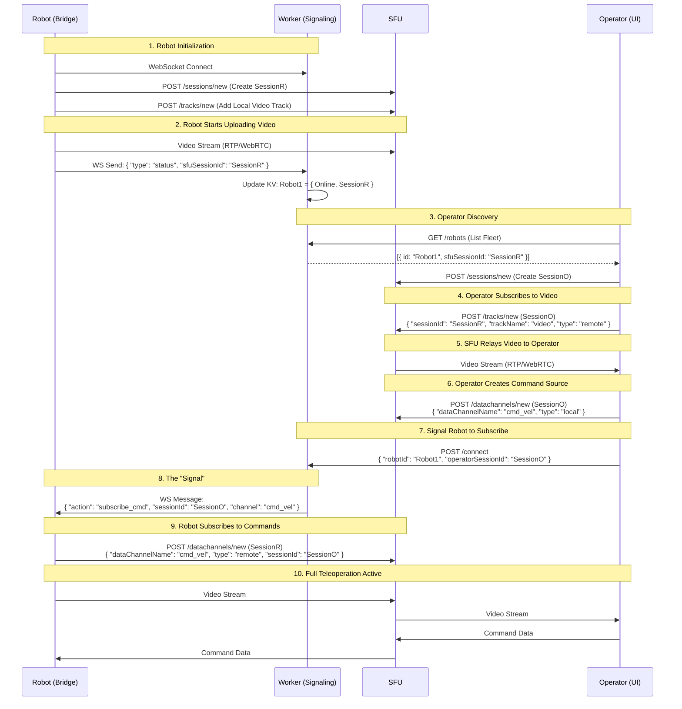

# Fleet Management Implementation Plan (Cloudflare SFU + Workers)

## Context
We are transforming a single-robot teleoperation system into a fleet management solution using Cloudflare Realtime SFU, Workers, and KV. The system allows operators to see a list of online robots, select one, and establish a low-latency video and control link.

## References
- **Video Translation Example**: [echo/index.html](https://github.com/cloudflare/realtime-examples/blob/main/echo/index.html)
- **Data Channel Example**: [echo-datachannels/index.html](https://github.com/cloudflare/realtime-examples/blob/main/echo-datachannels/index.html)
- **Cloudflare Realtime API Spec**: [calls-api-2024-05-21.yaml](https://developers.cloudflare.com/realtime/static/calls-api-2024-05-21.yaml)

## Architecture: Hybrid with KV + Workers
- **Signaling**: Cloudflare Worker (WebSocket + REST)
- **State**: Workers KV (Robot Registry)
- **Media/Data**: Cloudflare Realtime SFU (Video & DataChannels)

### Sequence Diagram

## Implementation Phases

### Phase 1: Cloudflare Worker (Signaling & Registry)
**Goal**: Create a Worker that manages robot state and signals connections.
**Location**: `cloud/workers/fleet-worker`

1.  **Setup**: 
    - Initialize a new Worker project if not exists.
    - Configure `wrangler.toml` with `KV_NAMESPACES` binding (`FLEET_STATE`).
2.  **WebSocket Handler (`/ws/robot`)**:
    -   Accept WebSocket upgrades.
    -   Maintain a map of active connections (using Durable Objects or in-memory if single instance for MVP).
    -   Handle `heartbeat` and `status` messages from robots.
    -   Update KV with robot status: `key: robot:<id>`, `value: { status: 'online', sfuSessionId: '...' }`.
3.  **REST API**:
    -   `GET /robots`: Query KV for keys starting with `robot:` and return list.
    -   `POST /connect`: 
        -   Body: `{ "robotId": "...", "operatorSessionId": "..." }`.
        -   Logic: Retrieve robot's active WebSocket.
        -   Send JSON: `{ "action": "subscribe_cmd", "sessionId": "...", "channel": "cmd_vel" }`.
4.  **Verification**:
    -   Use `wscat` to simulate a robot connecting and sending status.
    -   Use `curl` to call `GET /robots` and verify the mock robot appears.
    -   Use `curl` to call `POST /connect` and verify `wscat` receives the signal.

### Phase 2: Robot Bridge (`webrtc_ros2_bridge`)
**Goal**: Update C++ bridge to register with Worker and handle remote commands.
**Location**: `src/ugv_main/webrtc_ros2_bridge`

1.  **Dependencies**: 
    -   Add WebSocket client library (e.g., `websocketpp` or `boost::beast`) to `package.xml` and `CMakeLists.txt`.
2.  **Signaling Client Class**:
    -   Implement `SignalingClient` class.
    -   Connect to Worker `/ws/robot` on node startup.
    -   Send `status` message containing the local SFU Session ID (obtained from existing SFU logic).
3.  **Dynamic Subscription Logic**:
    -   Listen for `subscribe_cmd` WS message.
    -   Extract `sessionId` (remote operator) and `channel` name.
    -   Invoke existing SFU HTTP client to call `POST /datachannels/new` with `type: remote`.
4.  **DataChannel Integration**:
    -   Ensure the new DataChannel is hooked up to the existing `cmd_vel` publisher logic.
5.  **Verification**:
    -   Run the ROS2 node.
    -   Check Worker KV to see if robot is registered.
    -   Trigger `POST /connect` from terminal.
    -   Verify node logs indicate "Subscribing to remote DataChannel".

### Phase 3: Frontend Operator UI (`frontend`)
**Goal**: Very minimal and simplistic UI to list robots and initiate control. Feature reach UI will be a separate effort.
**Location**: `cloud/frontend`

1.  **Fleet List Component**:
    -   Fetch `GET /robots` from Worker.
    -   Display list of robots with status.
2.  **Connection Manager**:
    -   On "Connect" button click:
        -   Initialize local SFU Session (if not exists).
        -   Create local DataChannel `cmd_vel` (Source).
        -   Call `POST /connect` on Worker with `robotId` and `operatorSessionId`.
        -   Subscribe to Robot's video track (using `sfuSessionId` from robot list).
3.  **Teleop Integration**:
    -   Bind Joystick/Keyboard inputs to the `cmd_vel` DataChannel.
    -   Display the video stream in the `<video>` element.
4.  **Verification**:
    -   Launch UI.
    -   Select a mock robot (or real one if Phase 2 done).
    -   Verify video appears and controls send data.

### Phase 4: Integration & Testing
1.  **End-to-End Test**:
    -   Start Worker.
    -   Start Robot (Gazebo simulation + Bridge).
    -   Start Frontend.
    -   Verify Robot appears in list.
    -   Connect.
    -   Drive robot and watch video feed.

---
**Instructions for Copilot**:
- Use this document as the master plan.
- When asked to implement a phase, read the specific steps here.
- Update the `todoList` in the conversation context to track progress against these phases.
