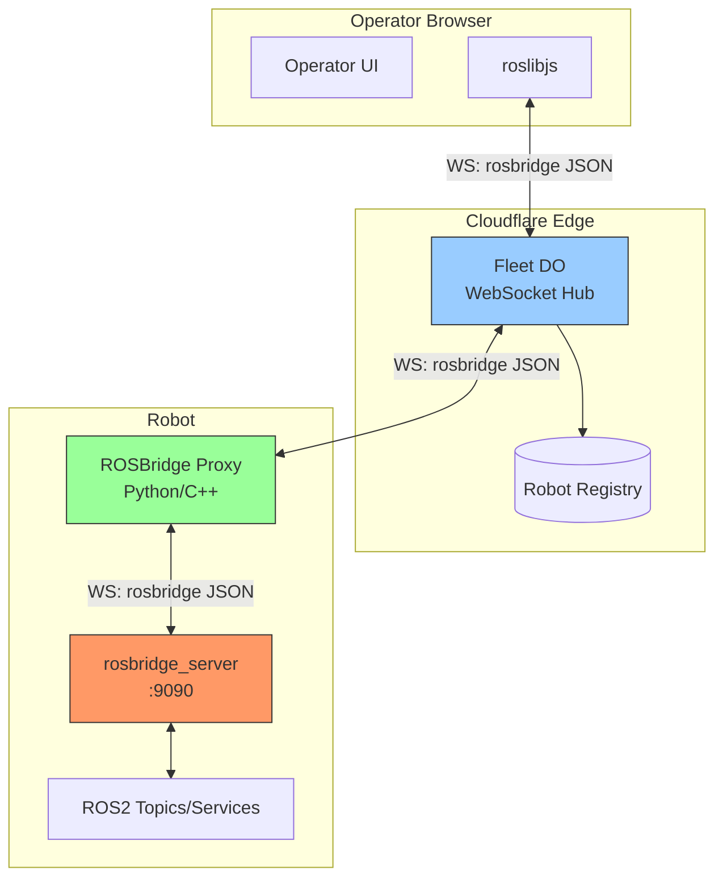
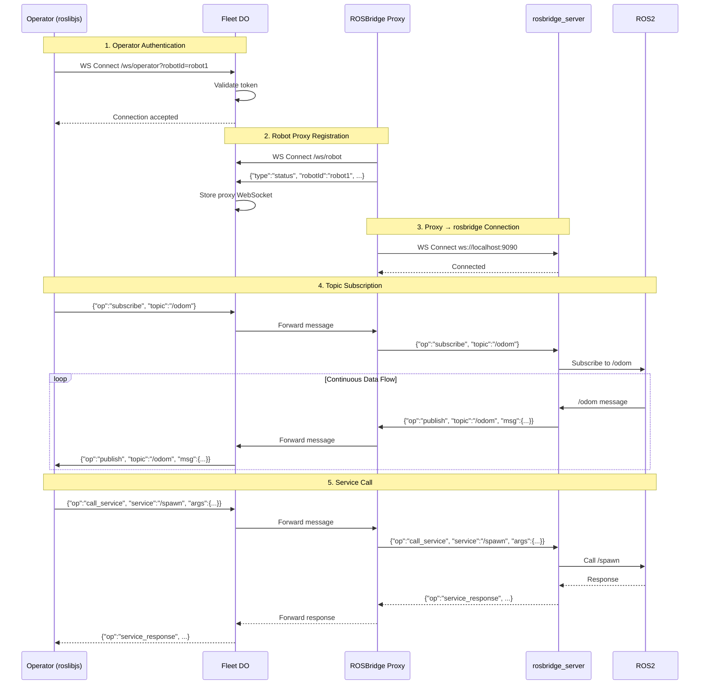
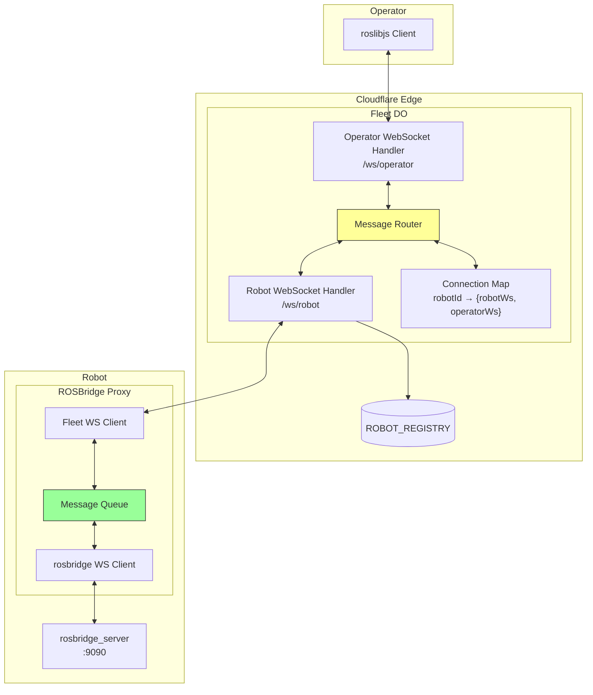
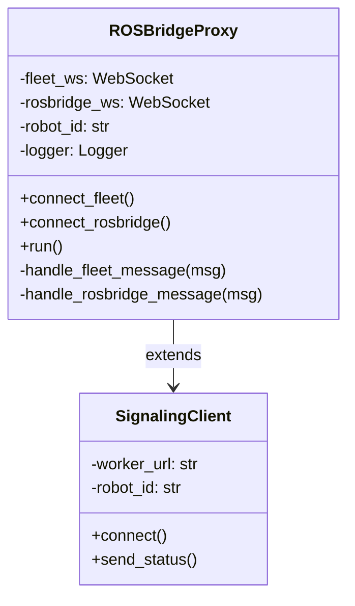
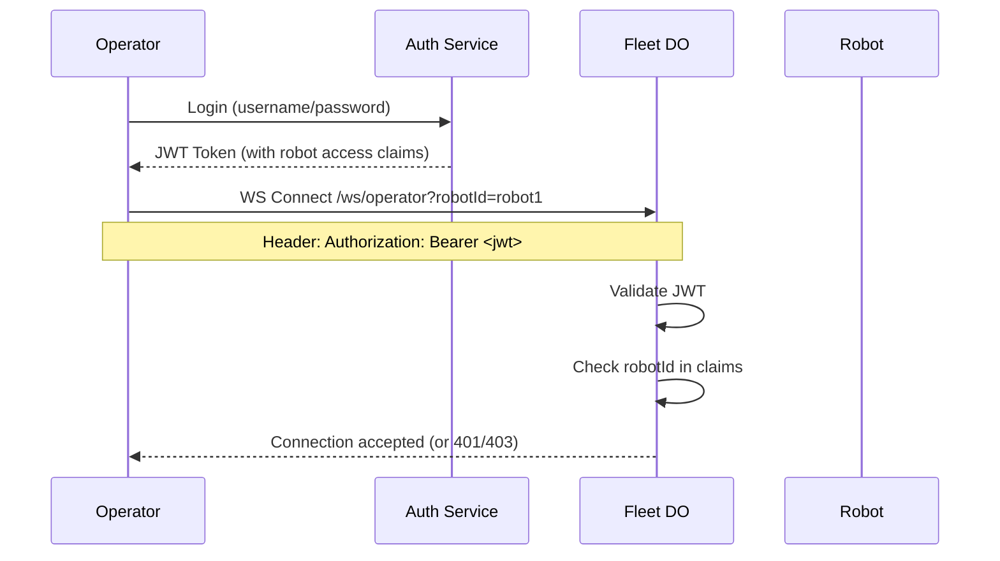
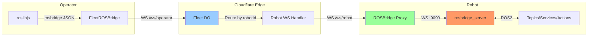

# ROSBridge Proxy Implementation Plan

## Overview

This document outlines the implementation plan for extending the Fleet Management architecture to include a WebSocket channel between Fleet DO (Cloudflare Durable Object) and the robot's `rosbridge_server`. This enables operators to send/receive arbitrary ROS messages (topics, services, actions) through the cloud infrastructure, not just `cmd_vel` commands.

## Problem Statement

Currently, the architecture supports:
- **Video streaming**: Robot → SFU → Operator (via WebRTC)
- **Command channel**: Operator → SFU → Robot (via DataChannel for `cmd_vel`)

**Missing capability**: Full rosbridge protocol support for:
- Subscribing to arbitrary ROS topics (e.g., `/odom`, `/battery_state`, `/diagnostics`)
- Calling ROS services
- Sending goals to action servers
- Publishing to arbitrary topics

## Architecture Comparison

### Option A: Direct WebSocket Proxy (Recommended)



**Pros:**
- Uses existing rosbridge protocol (no custom protocol design)
- Compatible with existing roslibjs clients
- Minimal changes to rosbridge_server
- Operator can use standard rosbridge tools

**Cons:**
- Requires proxy component on robot
- Higher latency for high-frequency topics
- rosbridge_server must be running

---

## Recommended Approach: Option A (Direct WebSocket Proxy)

### Rationale

1. **Compatibility**: Works with existing roslibjs and rosbridge tools
2. **Simplicity**: Proxy is just a message forwarder
3. **Flexibility**: Operators can use any rosbridge-compatible client
4. **Debugging**: Standard tools work (rqt, rosbridge test clients)

---

## Detailed Architecture

### Sequence Diagram: Full rosbridge Flow



### Component Diagram



---

## Implementation Phases

### Phase 1: Fleet DO Extension

**Goal**: Add operator WebSocket endpoint and message routing.

**Location**: `cloud/workers/fleet-worker/src/index.ts`

#### 1.1 New Types

```typescript
/** Operator connection info */
interface OperatorConnection {
    ws: WebSocket;
    robotId: string;
    connectedAt: number;
}

/** Message types for rosbridge proxy */
type ProxyMessageType = 
    | 'rosbridge'      // rosbridge JSON message
    | 'status'         // Robot status (existing)
    | 'subscribe_cmd'; // DataChannel signal (existing)

interface ProxyMessage {
    type: ProxyMessageType;
    payload?: unknown;
}
```

#### 1.2 New Endpoint: `/ws/operator`

```typescript
// In FleetDO.fetch()
if (url.pathname === '/ws/operator') {
    const robotId = url.searchParams.get('robotId');
    if (!robotId) {
        return new Response('Missing robotId', { status: 400 });
    }
    return this.handleOperatorWebSocket(request, robotId);
}
```

#### 1.3 Message Routing Logic

```typescript
private connectedOperators: Map<string, OperatorConnection> = new Map();

private routeRosbridgeMessage(
    fromRobot: boolean,
    robotId: string,
    message: string
): void {
    if (fromRobot) {
        // Robot → Operator
        const operator = this.connectedOperators.get(robotId);
        if (operator?.ws.readyState === WebSocket.OPEN) {
            operator.ws.send(message);
        }
    } else {
        // Operator → Robot
        const robot = this.connectedRobots.get(robotId);
        if (robot?.readyState === WebSocket.OPEN) {
            robot.send(JSON.stringify({
                type: 'rosbridge',
                payload: JSON.parse(message)
            }));
        }
    }
}
```

#### 1.4 Verification

- Use `wscat` to simulate both robot proxy and operator
- Verify messages flow bidirectionally
- Check proper cleanup on disconnect

---

### Phase 2: ROSBridge Proxy on Robot

**Goal**: Create a Python component that bridges Fleet DO WebSocket to local rosbridge_server.

**Location**: `src/ugv_main/webrtc_ros2_bridge/webrtc_ros2_bridge/rosbridge_proxy.py`

#### 2.1 Architecture



#### 2.2 Core Implementation

```python
class ROSBridgeProxy:
    """Proxies rosbridge messages between Fleet DO and local rosbridge_server."""
    
    def __init__(
        self,
        fleet_worker_url: str,
        robot_id: str,
        rosbridge_url: str = "ws://localhost:9090",
        logger=None
    ):
        self._fleet_url = fleet_worker_url
        self._robot_id = robot_id
        self._rosbridge_url = rosbridge_url
        self._logger = logger
        
        self._fleet_ws = None
        self._rosbridge_ws = None
        
    async def run(self):
        """Main run loop - maintains both connections."""
        await asyncio.gather(
            self._fleet_connection_loop(),
            self._rosbridge_connection_loop()
        )
        
    async def _handle_fleet_message(self, message: str):
        """Forward rosbridge messages from Fleet DO to rosbridge_server."""
        data = json.loads(message)
        if data.get('type') == 'rosbridge' and self._rosbridge_ws:
            await self._rosbridge_ws.send(json.dumps(data['payload']))
            
    async def _handle_rosbridge_message(self, message: str):
        """Forward rosbridge messages from rosbridge_server to Fleet DO."""
        if self._fleet_ws:
            await self._fleet_ws.send(json.dumps({
                'type': 'rosbridge',
                'payload': json.loads(message)
            }))
```

#### 2.3 Integration with Bridge Node

Add to `bridge_node.py`:

```python
# In __init__
if fleet_config.get("enable_rosbridge_proxy", False):
    self._rosbridge_proxy = ROSBridgeProxy(
        fleet_worker_url=fleet_config.get("worker_url"),
        robot_id=fleet_config.get("robot_id"),
        rosbridge_url=fleet_config.get("rosbridge_url", "ws://localhost:9090"),
        logger=self.get_logger()
    )
```

#### 2.4 Verification

- Start rosbridge_server: `ros2 launch rosbridge_server rosbridge_websocket_launch.xml`
- Start bridge node with proxy enabled
- Use roslibjs client to subscribe to `/odom`
- Verify messages flow through

---

### Phase 3: Operator UI Integration

**Goal**: Allow operators to use full rosbridge capabilities through the Fleet DO.

**Location**: `cloud/frontend/operator.js`

#### 3.1 Modified roslibjs Connection

```javascript
// Instead of connecting directly to robot's rosbridge
// Connect through Fleet DO

class FleetROSBridge {
    constructor(fleetWorkerUrl, robotId, token) {
        this.ws = new WebSocket(
            `${fleetWorkerUrl}/ws/operator?robotId=${robotId}&token=${token}`
        );
        
        // Wrap in ROSLIB.Ros-compatible interface
        this.ros = new ROSLIB.Ros();
        
        this.ws.onmessage = (event) => {
            const data = JSON.parse(event.data);
            if (data.type === 'rosbridge') {
                // Forward to roslibjs internal handler
                this.ros.callOnConnection({
                    data: JSON.stringify(data.payload)
                });
            }
        };
        
        // Override send to go through Fleet DO
        this.ros.socket = {
            send: (msg) => {
                this.ws.send(msg); // Fleet DO will wrap it
            }
        };
    }
}
```

#### 3.2 UI Components

```html
<!-- Topic Browser -->
<div id="topic-browser">
    <button onclick="refreshTopics()">Refresh Topics</button>
    <ul id="topic-list"></ul>
</div>

<!-- Topic Subscriber -->
<div id="topic-viewer">
    <select id="topic-select"></select>
    <button onclick="subscribeTopic()">Subscribe</button>
    <pre id="topic-data"></pre>
</div>

<!-- Service Caller -->
<div id="service-caller">
    <select id="service-select"></select>
    <textarea id="service-args">{}</textarea>
    <button onclick="callService()">Call</button>
    <pre id="service-result"></pre>
</div>
```

---

### Phase 4: Security & Authentication

**Goal**: Secure the rosbridge proxy channel.

#### 4.1 Authentication Flow



#### 4.2 Message Filtering (Optional)

```typescript
// In Fleet DO - filter dangerous operations
const BLOCKED_OPERATIONS = [
    'call_service:/shutdown',
    'publish:/cmd_vel',  // Use DataChannel instead
];

function shouldAllowMessage(msg: RosbridgeMessage): boolean {
    const op = `${msg.op}:${msg.topic || msg.service || ''}`;
    return !BLOCKED_OPERATIONS.some(blocked => op.startsWith(blocked));
}
```

---

## Configuration Updates

### bridge_config.yaml

```yaml
fleet:
  worker_url: "wss://fleet-worker.your-domain.workers.dev/ws/robot"
  robot_id: "robot1"
  enable_rosbridge_proxy: true
  rosbridge_url: "ws://localhost:9090"
  
rosbridge:
  # Local rosbridge_server settings
  port: 9090
  authenticate: false
```

### wrangler.toml

```toml
[vars]
ROSBRIDGE_PROXY_ENABLED = "true"

# Rate limiting for rosbridge messages
ROSBRIDGE_RATE_LIMIT_PER_SECOND = "100"
```

---

## Message Flow Summary



---

## Performance Considerations

| Aspect | Recommendation |
|--------|----------------|
| High-frequency topics | Use DataChannel for `/cmd_vel`, video. Use rosbridge proxy for low-frequency topics. |
| Large messages | Consider compression (rosbridge supports CBOR) |
| Latency | Cloudflare edge reduces latency vs direct P2P in many cases |
| Connection drops | Implement reconnection logic with exponential backoff |
| Message ordering | WebSocket guarantees order; no special handling needed |

---

## Testing Checklist

### Phase 1 (Fleet DO)
- [ ] Operator can connect via `/ws/operator?robotId=xxx`
- [ ] Messages route correctly robot → operator
- [ ] Messages route correctly operator → robot
- [ ] Connection cleanup on disconnect
- [ ] Multiple operators to same robot works

### Phase 2 (ROSBridge Proxy)
- [ ] Proxy connects to Fleet DO
- [ ] Proxy connects to local rosbridge_server
- [ ] rosbridge subscribe messages work
- [ ] rosbridge service calls work
- [ ] Reconnection on connection loss

### Phase 3 (Operator UI)
- [ ] roslibjs works through proxy
- [ ] Topic list displays
- [ ] Topic subscription shows data
- [ ] Service calls work

### Phase 4 (Security)
- [ ] Unauthenticated connections rejected
- [ ] Invalid robot access rejected
- [ ] Blocked operations filtered

---

## Dependencies

### Robot
- `websockets` (Python) - already in requirements
- `rosbridge_server` (ROS2 package)

### Cloudflare Worker
- No new dependencies (WebSocket native)

### Frontend
- `roslibjs` - standard rosbridge client library

---

## File Structure After Implementation

```
cloud/workers/fleet-worker/
├── src/
│   └── index.ts              # Extended with operator WS + routing
├── wrangler.toml
└── README.md                 # Updated documentation

src/ugv_main/webrtc_ros2_bridge/
├── webrtc_ros2_bridge/
│   ├── bridge_node.py        # Updated to integrate proxy
│   ├── rosbridge_proxy.py    # NEW: Fleet ↔ rosbridge proxy
│   ├── signaling_client.py   # Existing (may need updates)
│   └── ...
└── config/
    └── bridge_config.yaml    # Updated with proxy settings

cloud/frontend/
├── operator.js               # Updated with FleetROSBridge class
└── index.html                # Updated with rosbridge UI components
```

---

## Next Steps

1. **Review this plan** - Confirm Option A (Direct WebSocket Proxy) is preferred
2. **Start Phase 1** - Extend Fleet DO with operator WebSocket endpoint
3. **Parallel: Phase 2** - Implement ROSBridge Proxy on robot
4. **Phase 3** - Integrate with Operator UI
5. **Phase 4** - Add security/authentication

---

**Questions for Clarification:**
1. Should we support multiple operators per robot for rosbridge (read-only subscribers)?
2. Is there a list of topics/services that should be blocked for security?
3. Should we implement message compression (CBOR) from the start?
4. Do we need authentication before Phase 4, or is robotId-based access sufficient for now?
