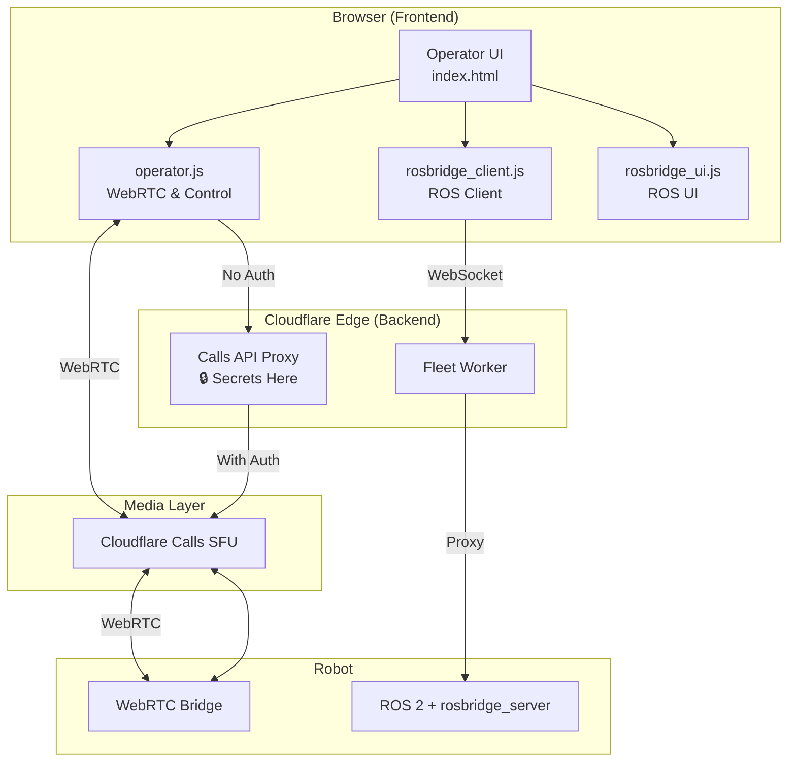
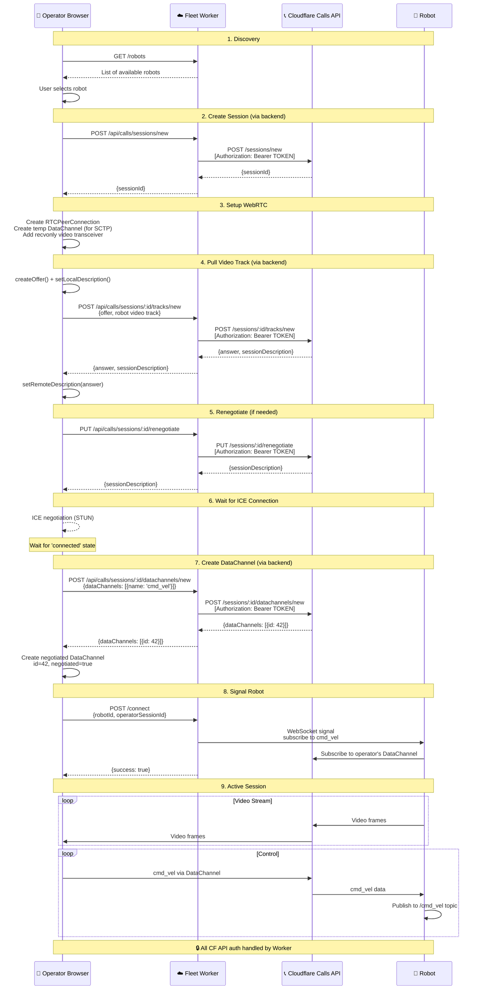

# Fleet Operator Frontend

Web-based operator console for controlling UGV robots via WebRTC and ROS 2. **No secrets exposed** - all API credentials handled by backend.

## Architecture

The operator console provides two communication channels:

### 1. WebRTC Video & Control
- Video streaming from robot cameras (Cloudflare Calls SFU)
- Low-latency cmd_vel via DataChannel
- Manual control (joystick & keyboard)

### 2. ROSBridge Integration
- Full ROS 2 interaction via cloud proxy
- Topic subscribe/publish
- Service calls
- Action client
- Navigation controls



## Files

| File | Description |
|------|-------------|
| `index.html` | Main operator console page with UI |
| `operator.js` | WebRTC connection and control logic (uses backend API) |
| `rosbridge_client.js` | FleetROSBridge client (roslibjs-compatible) |
| `rosbridge_ui.js` | ROSBridge UI controller with presets |

## Security Features

✅ **No secrets in browser** - Cloudflare credentials stored on backend
✅ **Backend API proxy** - All Calls API requests go through worker
✅ **No Authorization headers** - Frontend never handles API tokens
✅ **Clean separation** - UI is purely presentational

## Connection Sequence

Complete sequence for connecting operator to robot:



## API Integration

### Backend Endpoints Used

All endpoints proxy to Cloudflare Calls API with authentication:

| Frontend Call | Backend Endpoint | Adds Auth? |
|---------------|------------------|------------|
| `backendFetch('/api/calls/sessions/new')` | POST to Cloudflare | ✅ Yes |
| `backendFetch('/api/calls/sessions/:id/tracks/new')` | POST to Cloudflare | ✅ Yes |
| `backendFetch('/api/calls/sessions/:id/renegotiate')` | PUT to Cloudflare | ✅ Yes |
| `backendFetch('/api/calls/sessions/:id/datachannels/new')` | POST to Cloudflare | ✅ Yes |
| `backendFetch('/connect')` | POST to Fleet Worker | N/A |

### Helper Function

```javascript
// operator.js - No secrets!
async function backendFetch(endpoint, options = {}) {
    const workerUrl = getWorkerUrl();
    const url = `${workerUrl}${endpoint}`;

    const response = await fetch(url, {
        ...options,
        headers: {
            'Content-Type': 'application/json',
            ...options.headers,
        },
    });

    return response;
}
```

**Before refactoring:**
```javascript
// ❌ Old way - secrets exposed
await fetch(`${CALLS_API_BASE}/${appId}/sessions/new`, {
    headers: {
        'Authorization': `Bearer ${appToken}`, // SECRET IN BROWSER!
        'Content-Type': 'application/json'
    }
});
```

**After refactoring:**
```javascript
// ✅ New way - no secrets
await backendFetch('/api/calls/sessions/new', {
    method: 'POST'
});
// Backend adds Authorization header
```

## ROSBridge Features

### Topic Operations
- Subscribe to any ROS topic with throttling
- Publish messages to topics
- Presets for common topics (/rosout, /odom, /scan, /cmd_vel, etc.)

### Service Calls
- Call ROS services with JSON request data
- View responses in JSON format
- **Launch Manager presets:**
  - Get Mode - Query current operational mode
  - → Idle, → Mapping, → Navigation - Mode switching
  - Stop Mode, Stop All - Process control
  - Save Map - Save current SLAM map

### Action Client
- Send action goals (NavigateToPose, Spin, BackUp, etc.)
- Receive real-time feedback
- Cancel running actions

### Quick Navigation
- Send navigation goals with X, Y, Yaw coordinates
- Preset buttons for common movements (1m forward/back/left/right)
- Cancel navigation button

## Usage

1. **Open operator console** - Load `index.html` in browser
2. **Refresh robot list** - Click "🔄 Refresh Robot List"
3. **Select robot** - Click on a robot from the list
4. **Connect WebRTC** - Click "Connect to Selected Robot"
   - Video stream starts
   - Controls enabled (joystick & keyboard)
5. **Connect ROSBridge** (optional) - Click "🔗 Connect ROSBridge"
   - ROS interface tabs enabled
6. **Use controls:**
   - **Joystick**: Drag to control movement
   - **Keyboard**: W/A/S/D or arrow keys
   - **ROSBridge tabs**: Subscribe to topics, call services, send actions

## Data Structures

### Robot Registry Entry
```json
{
  "id": "robot-abc123",
  "status": "online",
  "sfuSessionId": "sfu-session-uuid",
  "videoTrackName": "robot-abc123-video",
  "lastSeen": 1733567890123
}
```

### cmd_vel Message
```json
{
  "linear": { "x": 0.5, "y": 0.0, "z": 0.0 },
  "angular": { "x": 0.0, "y": 0.0, "z": 0.3 }
}
```

## Critical Implementation Details

### 1. Backend API Proxy (Security)

Frontend **never** includes `Authorization` headers:

```javascript
// Frontend code
const response = await backendFetch('/api/calls/sessions/new', {
    method: 'POST'
});

// Backend adds auth transparently
// Worker code:
fetch(callsUrl, {
    headers: {
        'Authorization': `Bearer ${env.CF_CALLS_APP_TOKEN}`, // SECRET
        'Content-Type': 'application/json'
    }
});
```

### 2. Negotiated DataChannel

Both operator and robot must use the same DataChannel ID from SFU:

```javascript
// WRONG - won't route through SFU
const dc = peerConnection.createDataChannel('cmd_vel');

// CORRECT - use SFU-assigned ID
const dcResp = await backendFetch(`/api/calls/sessions/${sessionId}/datachannels/new`, {
    method: 'POST',
    body: JSON.stringify({
        dataChannels: [{ location: 'local', dataChannelName: 'cmd_vel' }]
    })
});
const dcId = dcResp.json().dataChannels[0].id;

const dc = peerConnection.createDataChannel('cmd_vel', {
    negotiated: true,
    id: dcId  // Use SFU-assigned ID
});
```

### 3. SCTP Transport in SDP

Create temporary DataChannel **before** `createOffer()`:

```javascript
// Create temp channel to include SCTP in SDP
const tempChannel = peerConnection.createDataChannel('cmd_vel_temp', {
    ordered: true
});

// Now createOffer() will include SCTP transport
const offer = await peerConnection.createOffer();
await peerConnection.setLocalDescription(offer);

// After offer is sent, close temp channel
tempChannel.close();
```

### 4. ICE Connection Timing

Wait for ICE before creating negotiated DataChannels:

```javascript
// Wait for ICE to connect
await waitForICE(peerConnection);

// Then create DataChannel
const dcResp = await backendFetch(...);
```

## Development

### Local Development

```bash
# Start simple HTTP server
python -m http.server 8080

# Or use wrangler pages dev
npm run dev
```

Update worker URL in browser:
1. Open http://localhost:8080
2. Change "Fleet Worker URL" to `http://localhost:8787` (local worker)

### Verify No Secrets Exposed

1. Open browser DevTools → Network tab
2. Connect to a robot
3. Filter requests by `calls`
4. Click any request → Headers
5. **Verify:** No `Authorization: Bearer ...` in Request Headers ✅

## Deployment

```bash
# Update worker URL in index.html (line ~296)
# value="https://YOUR-WORKER-URL.workers.dev"

# Deploy to Cloudflare Pages
npm run deploy
```

## Troubleshooting

### "Failed to fetch robots"
- Check worker URL is correct
- Verify worker is deployed and running
- Check browser console for errors

### "Connection failed"
- Ensure backend secrets are configured
- Check worker logs: `wrangler tail`
- Verify robot is online and registered

### Video not showing
- Check robot is publishing video track
- Verify SFU session IDs match
- Check ICE connection state

### Controls not working
- Verify DataChannel is open (check logs)
- Ensure robot subscribed to operator's channel
- Check cmd_vel messages in network tab

### ROSBridge not connecting
- Check robot is running rosbridge_server
- Verify WebSocket connection to worker
- Check robot ID is correct

## Architecture Benefits

### Security
- Zero secrets in browser code
- Backend proxy handles all authentication
- Tokens never leave server infrastructure
- Can't be extracted from browser DevTools

### Future-Proof
- Easy to migrate to React/Vue/Svelte
- Same backend API works with any frontend
- Clean separation of concerns
- Can build mobile/desktop apps with same backend

### Developer Experience
- Simple API - just call `backendFetch()`
- No credential management in frontend code
- Easier to test and debug
- Less error-prone

## Related Documentation

- [../README.md](../README.md) - Overall system documentation & deployment
- [../workers/fleet-worker/README.md](../workers/fleet-worker/README.md) - Backend details
- [Cloudflare Pages Docs](https://developers.cloudflare.com/pages/)
- [WebRTC API](https://developer.mozilla.org/en-US/docs/Web/API/WebRTC_API)
