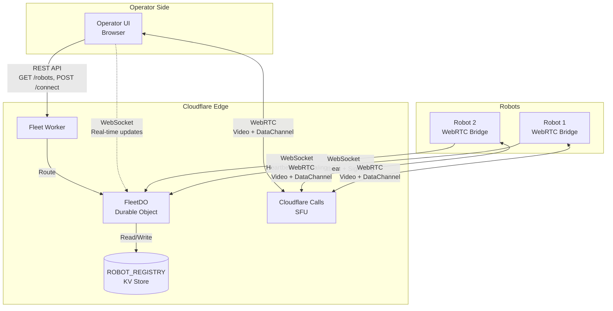
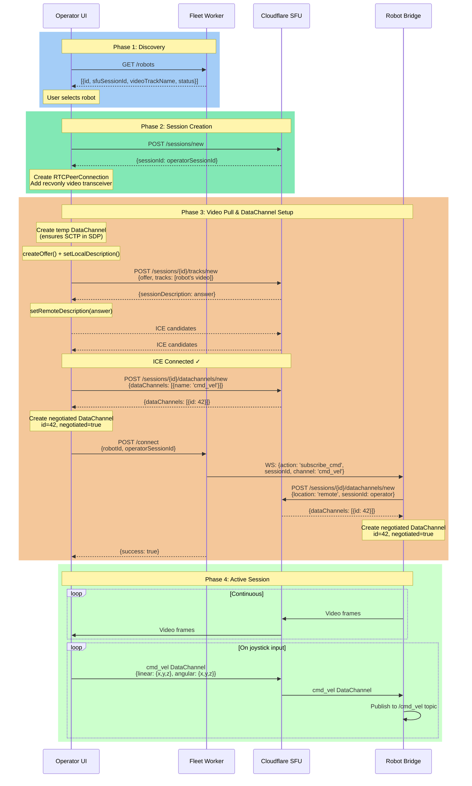

# Fleet Operator Frontend

Web-based operator console for controlling UGV robots via WebRTC through Cloudflare Calls SFU.

## Current State

`test_operator.html` is a working proof-of-concept that demonstrates:
- Fetching online robots from fleet worker
- Establishing WebRTC connection via Cloudflare SFU
- Pulling video stream from robot
- Sending joystick/keyboard commands via DataChannel

## Architecture Overview



> **Note**: Dashed line (WebSocket for operator) is planned but not yet implemented. 
> Currently operators use REST polling for robot list updates.

## Connection Flow

### Complete Sequence Diagram



### Phase Breakdown

#### Phase 1: Discovery
- Operator loads UI and fetches robot list from Fleet Worker
- Fleet Worker returns robots with their SFU session IDs and video track names
- Operator selects a robot to control

#### Phase 2: Session Creation  
- Operator creates their own SFU session via Cloudflare Calls API
- Creates RTCPeerConnection with recvonly video transceiver
- Session is ready but not yet connected to robot

#### Phase 3: Video Pull & DataChannel Setup
- **Critical**: Create temporary DataChannel BEFORE `createOffer()` to include SCTP transport
- Pull robot's video track via SFU `/tracks/new` endpoint
- Complete ICE negotiation and wait for connection
- Register `cmd_vel` DataChannel with SFU to get assigned ID
- **Critical**: Create DataChannel with `negotiated: true` and SFU-assigned ID
- Signal robot via Fleet Worker to subscribe to operator's DataChannel
- Robot creates matching negotiated DataChannel with same ID

#### Phase 4: Active Session
- Video flows: Robot → SFU → Operator (continuous)
- Commands flow: Operator → SFU → Robot (on input)
- Robot publishes received commands to ROS2 `/cmd_vel` topic

## Data Structures

### Robot Registry Entry (Fleet Worker KV)
```json
{
  "id": "robot-abc123",
  "status": "online",
  "sfuSessionId": "sfu-session-uuid",
  "videoTrackName": "robot-abc123-video",
  "dataChannelName": "robot-events",
  "lastSeen": "2024-12-07T10:30:00Z"
}
```

### Command Message (cmd_vel DataChannel)
```json
{
  "linear": { "x": 0.5, "y": 0.0, "z": 0.0 },
  "angular": { "x": 0.0, "y": 0.0, "z": 0.3 }
}
```

### Connect Signal (Fleet Worker → Robot)
```json
{
  "type": "operator_connect",
  "operatorSessionId": "operator-sfu-session-uuid"
}
```

## API Reference

### Fleet Worker Endpoints

| Method | Endpoint | Description |
|--------|----------|-------------|
| GET | `/robots` | List all registered robots |
| GET | `/robots/:id` | Get specific robot details |
| POST | `/connect` | Signal robot to accept operator connection |
| WS | `/ws/operator` | WebSocket for real-time updates (future) |

### Cloudflare Calls API

| Method | Endpoint | Description |
|--------|----------|-------------|
| POST | `/sessions/new` | Create new SFU session |
| POST | `/sessions/:id/tracks/new` | Push/pull media tracks |
| PUT | `/sessions/:id/renegotiate` | Update SDP after changes |
| POST | `/sessions/:id/datachannels/new` | Register DataChannel |

## Critical Implementation Notes

### DataChannel Routing (IMPORTANT!)
Both peers MUST use `negotiated: true` with the SFU-assigned ID:
```javascript
// WRONG - won't route through SFU
const dc = pc.createDataChannel('cmd_vel');

// CORRECT - use ID from /datachannels/new response
const dc = pc.createDataChannel('cmd_vel', {
  negotiated: true,
  id: sfuAssignedId  // from API response
});
```

### SCTP Transport in SDP
The initial SDP offer MUST include SCTP transport for DataChannels to work:
```javascript
// Create a temporary DataChannel BEFORE createOffer()
const temp = pc.createDataChannel('temp');
const offer = await pc.createOffer();  // Now includes SCTP
temp.close();  // Close after offer is created
```

### ICE Connection Timing
Wait for ICE connection before creating negotiated DataChannels:
```javascript
await waitForICE(peerConnection);  // Wait for 'connected' state
// Then register and create DataChannel
```

## Development Workflow

1. **Start Fleet Worker** (Cloudflare Workers)
   ```bash
   cd cloud/workers/fleet-worker
   wrangler dev
   ```

2. **Start Robot Bridge** (on robot or dev machine)
   ```bash
   ros2 launch webrtc_ros2_bridge bridge.launch.py
   ```

3. **Open Test Console**
   - Open `test_operator.html` in browser
   - Enter Cloudflare App Token
   - Refresh robots list
   - Select robot → Create Session → Connect
