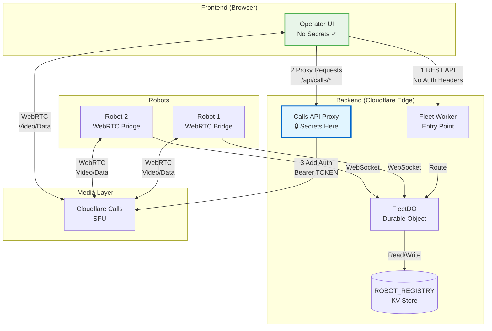
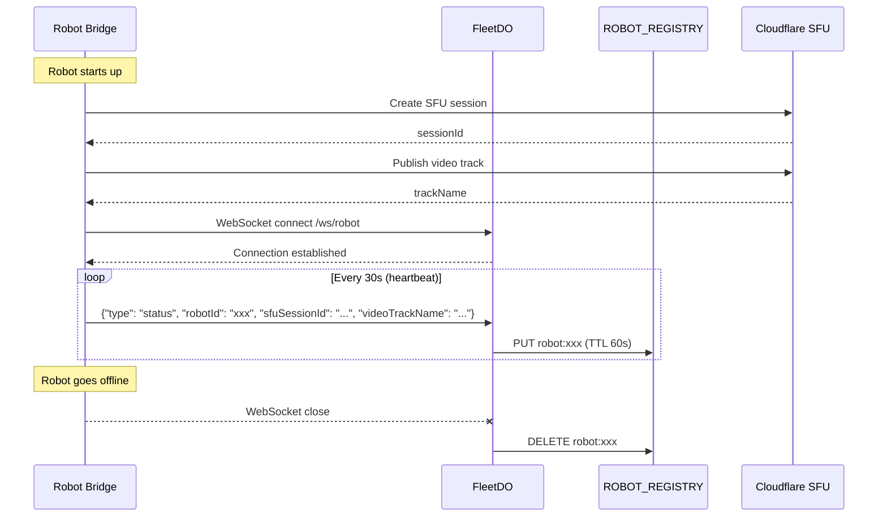
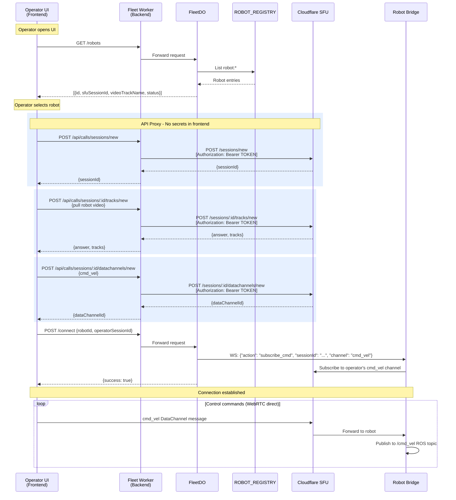
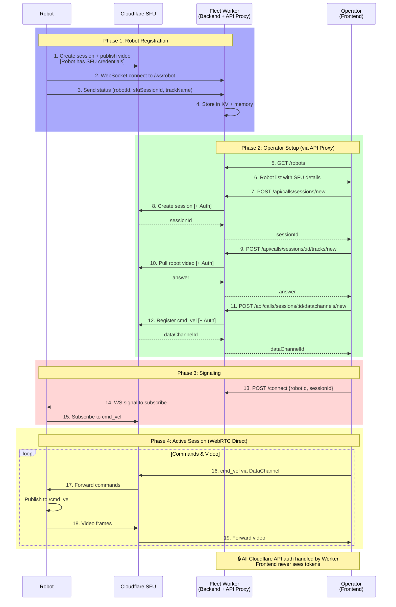

# Fleet Worker

Cloudflare Worker that provides fleet management, robot registry, and signaling for WebRTC connections between operators and robots.

## Architecture Overview



## Components

### 1. Fleet Worker (Entry Point)

The main Worker handles incoming HTTP requests and routes them to the Durable Object.

```typescript
// All requests are routed to a single FleetDO instance
const id = env.FLEET_DO.idFromName('default-fleet');
const stub = env.FLEET_DO.get(id);
return stub.fetch(request);
```

**Responsibilities:**
- CORS handling for browser requests
- Routing all requests to the FleetDO singleton

### 2. FleetDO (Durable Object)

Stateful singleton that maintains WebSocket connections to all robots and handles signaling.

**State:**
- `connectedRobots: Map<string, WebSocket>` - Active WebSocket connections to robots
- `connectedOperators: Map<string, OperatorConnection>` - Active WebSocket connections from operators

**Endpoints:**

| Method | Path | Description |
|--------|------|-------------|
| WS | `/ws/robot` | WebSocket endpoint for robot connections |
| WS | `/ws/operator?robotId=xxx` | WebSocket endpoint for operator rosbridge proxy |
| GET | `/robots` | List all registered robots |
| POST | `/connect` | Signal robot to subscribe to operator's DataChannel |
| POST | `/api/calls/sessions/new` | **Proxy** - Create SFU session (adds auth) |
| POST | `/api/calls/sessions/:id/tracks/new` | **Proxy** - Pull video track (adds auth) |
| PUT | `/api/calls/sessions/:id/renegotiate` | **Proxy** - Renegotiate connection (adds auth) |
| POST | `/api/calls/sessions/:id/datachannels/new` | **Proxy** - Create DataChannel (adds auth) |

### 3. ROBOT_REGISTRY (KV Store)

Persistent key-value store for robot metadata.

**Key Format:** `robot:{robotId}`

**Value Schema:**
```json
{
  "status": "online",
  "sfuSessionId": "uuid-of-robot-sfu-session",
  "videoTrackName": "robot-id-video",
  "lastSeen": 1733567890123
}
```

**TTL:** 60 seconds (auto-expires if robot stops sending heartbeats)

## Sequence Diagrams

### Robot Registration Flow



### Operator Connection Flow (with API Proxy)



### Complete System Flow (with Backend API Proxy)



## API Reference

### WebSocket: `/ws/robot`

Robot connection endpoint. Robots maintain a persistent WebSocket to receive signals.

**Robot → Worker Messages:**

```json
{
  "type": "status",
  "robotId": "robot-unique-id",
  "sfuSessionId": "cloudflare-sfu-session-id",
  "videoTrackName": "robot-unique-id-video"
}
```

**Worker → Robot Messages:**

```json
{
  "action": "subscribe_cmd",
  "sessionId": "operator-sfu-session-id",
  "channel": "cmd_vel"
}
```

**Worker → Robot Messages (rosbridge proxy):**

```json
{
  "type": "rosbridge",
  "payload": { /* rosbridge JSON message from operator */ }
}
```

### WebSocket: `/ws/operator?robotId=xxx`

Operator connection endpoint for rosbridge message proxying. Operators connect here to send/receive rosbridge protocol messages to/from a specific robot.

**Query Parameters:**
- `robotId` (required): Target robot ID to proxy messages to

**Worker → Operator Messages (on connect):**

```json
{
  "type": "connected",
  "operatorSessionId": "op-1234567890-abc123xyz",
  "robotId": "robot-abc123",
  "robotConnected": true
}
```

**Worker → Operator Messages (robot disconnect):**

```json
{
  "type": "robot_disconnected",
  "robotId": "robot-abc123"
}
```

**Operator → Worker Messages:**

Any valid rosbridge JSON message (subscribe, advertise, publish, call_service, etc.):

```json
{
  "op": "subscribe",
  "topic": "/odom",
  "type": "nav_msgs/Odometry"
}
```

**Worker → Operator Messages (rosbridge response):**

Raw rosbridge JSON responses from the robot's rosbridge_server:

```json
{
  "op": "publish",
  "topic": "/odom",
  "msg": { /* Odometry message */ }
}
```

### REST: `GET /robots`

Returns list of all registered robots.

**Response:**
```json
[
  {
    "id": "robot-abc123",
    "status": "online",
    "sfuSessionId": "sfu-session-uuid",
    "videoTrackName": "robot-abc123-video",
    "lastSeen": 1733567890123
  }
]
```

### REST: `POST /connect`

Signal a robot to subscribe to an operator's DataChannel.

**Request:**
```json
{
  "robotId": "robot-abc123",
  "operatorSessionId": "operator-sfu-session-uuid"
}
```

**Response (success):**
```json
{
  "success": true
}
```

**Response (robot not found):**
```
HTTP 404: Robot not connected to this Fleet DO
```

## Configuration

### Environment Variables (Secrets)

The worker requires Cloudflare Calls API credentials for the proxy functionality:

| Variable | Description |
|----------|-------------|
| `CF_CALLS_APP_ID` | Cloudflare Calls Application ID |
| `CF_CALLS_APP_TOKEN` | Cloudflare Calls API Token |

**Set in production:**
```bash
wrangler secret put CF_CALLS_APP_ID
wrangler secret put CF_CALLS_APP_TOKEN
```

**Set for local development:**
Create `.dev.vars` file (gitignored):
```
CF_CALLS_APP_ID=your_app_id_here
CF_CALLS_APP_TOKEN=your_token_here
```

### wrangler.toml

```toml
name = "fleet-worker"
main = "src/index.ts"

[[kv_namespaces]]
binding = "ROBOT_REGISTRY"
id = "your-kv-namespace-id"

[[durable_objects.bindings]]
name = "FLEET_DO"
class_name = "FleetDO"

[[migrations]]
tag = "v1"
new_classes = ["FleetDO"]

# Secrets configured via wrangler secret put (see above)
```

## Key Design Decisions

### Why Durable Objects?

1. **WebSocket State**: Durable Objects can hold open WebSocket connections, which regular Workers cannot
2. **In-Memory Robot Map**: Fast lookup of connected robots without KV reads
3. **Singleton Pattern**: All robots connect to the same DO instance for coordinated signaling

### Why KV Store?

1. **Persistence**: Robot data survives DO hibernation
2. **TTL Support**: Auto-cleanup of stale robot entries
3. **Global Read**: Operators can query robot list from any edge location

### Why Separate SFU?

1. **Media Routing**: Cloudflare Calls handles the actual WebRTC media relay
2. **Scalability**: SFU handles video encoding/decoding, Worker handles signaling only
3. **Low Latency**: Media flows directly through SFU, not through Worker

### Why API Proxy?

1. **Security**: Keeps Cloudflare Calls credentials secret on backend
2. **No Frontend Secrets**: Browser never sees API tokens
3. **Centralized Auth**: All API authentication in one place
4. **Future-Proof**: Easy to add rate limiting, logging, monitoring

## Development

```bash
# Install dependencies
npm install

# Configure local secrets
cp .dev.vars.example .dev.vars
nano .dev.vars  # Add your credentials

# Run locally
wrangler dev

# Deploy to production
wrangler deploy
```

## File Structure

```
fleet-worker/
├── src/
│   └── index.ts      # Worker + Durable Object implementation
├── package.json
├── tsconfig.json
├── wrangler.toml     # Cloudflare configuration
└── README.md
```
