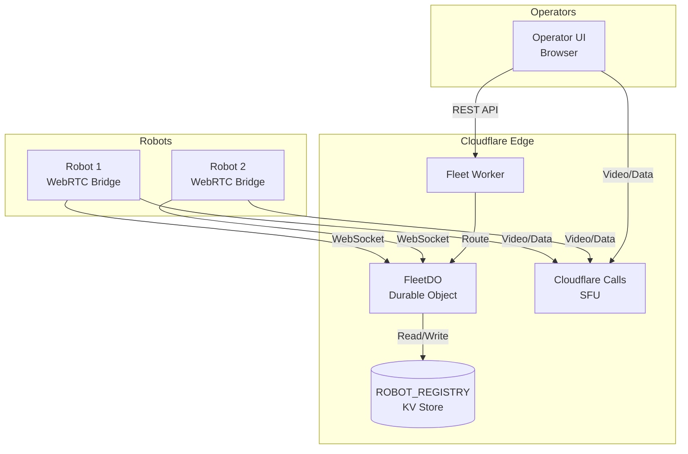
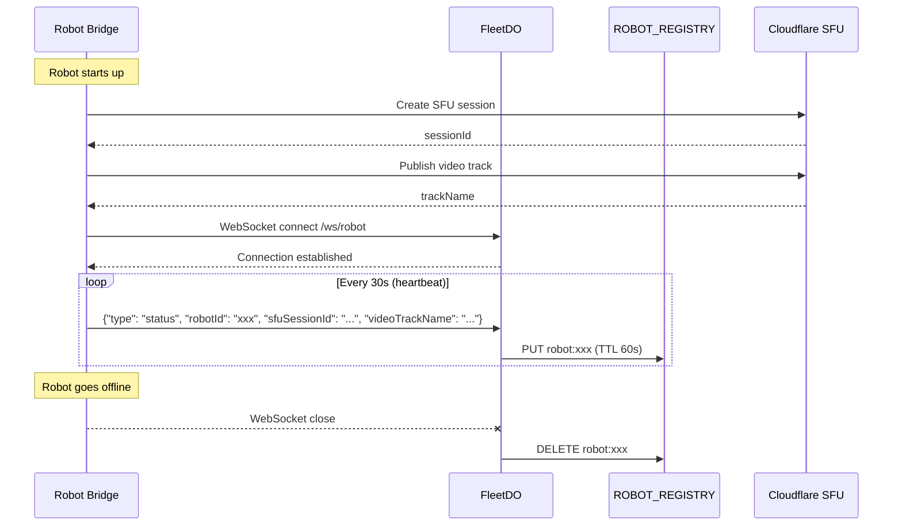
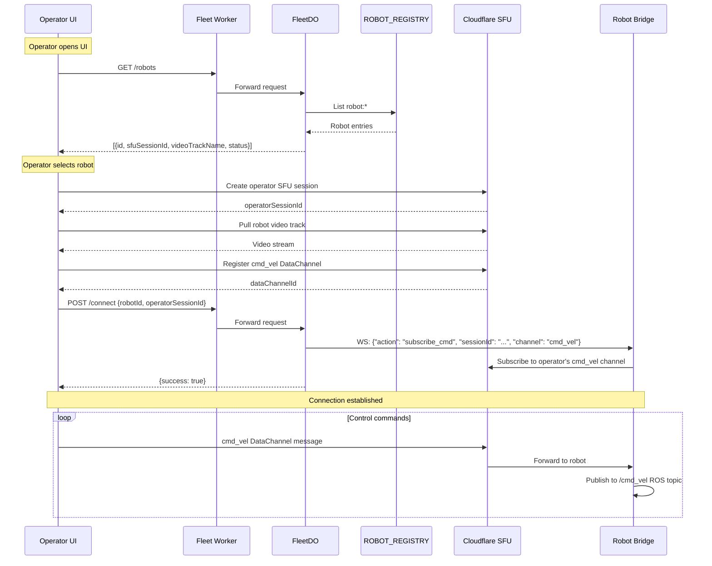

# Fleet Worker

Cloudflare Worker that provides fleet management, robot registry, and signaling for WebRTC connections between operators and robots.

## Architecture Overview



## Components

### 1. Fleet Worker (Entry Point)

The main Worker handles incoming HTTP requests and routes them to the Durable Object.

```typescript
// All requests are routed to a single FleetDO instance
const id = env.FLEET_DO.idFromName('default-fleet');
const stub = env.FLEET_DO.get(id);
return stub.fetch(request);
```

**Responsibilities:**
- CORS handling for browser requests
- Routing all requests to the FleetDO singleton

### 2. FleetDO (Durable Object)

Stateful singleton that maintains WebSocket connections to all robots and handles signaling.

**State:**
- `connectedRobots: Map<string, WebSocket>` - Active WebSocket connections to robots

**Endpoints:**

| Method | Path | Description |
|--------|------|-------------|
| WS | `/ws/robot` | WebSocket endpoint for robot connections |
| GET | `/robots` | List all registered robots |
| POST | `/connect` | Signal robot to subscribe to operator's DataChannel |

### 3. ROBOT_REGISTRY (KV Store)

Persistent key-value store for robot metadata.

**Key Format:** `robot:{robotId}`

**Value Schema:**
```json
{
  "status": "online",
  "sfuSessionId": "uuid-of-robot-sfu-session",
  "videoTrackName": "robot-id-video",
  "lastSeen": 1733567890123
}
```

**TTL:** 60 seconds (auto-expires if robot stops sending heartbeats)

## Sequence Diagrams

### Robot Registration Flow



### Operator Connection Flow



### Complete System Flow

```mermaid
sequenceDiagram
    participant R as Robot
    participant SFU as Cloudflare SFU
    participant DO as Fleet DO
    participant O as Operator

    rect rgb(40, 40, 80)
        Note over R,DO: Phase 1: Robot Registration
        R->>SFU: 1. Create session + publish video
        R->>DO: 2. WebSocket connect
        R->>DO: 3. Send status (robotId, sfuSessionId, trackName)
    end

    rect rgb(40, 80, 40)
        Note over O,SFU: Phase 2: Operator Setup
        O->>DO: 4. GET /robots
        DO-->>O: 5. Robot list with SFU details
        O->>SFU: 6. Create session
        O->>SFU: 7. Pull robot video
        O->>SFU: 8. Register cmd_vel channel
    end

    rect rgb(80, 40, 40)
        Note over O,R: Phase 3: Signaling
        O->>DO: 9. POST /connect
        DO->>R: 10. WS signal to subscribe
        R->>SFU: 11. Subscribe to cmd_vel
    end

    rect rgb(80, 80, 40)
        Note over O,R: Phase 4: Active Session
        O->>SFU: 12. Send commands
        SFU->>R: 13. Forward commands
        R->>SFU: 14. Video frames
        SFU->>O: 15. Forward video
    end
```



## API Reference

### WebSocket: `/ws/robot`

Robot connection endpoint. Robots maintain a persistent WebSocket to receive signals.

**Robot → Worker Messages:**

```json
{
  "type": "status",
  "robotId": "robot-unique-id",
  "sfuSessionId": "cloudflare-sfu-session-id",
  "videoTrackName": "robot-unique-id-video"
}
```

**Worker → Robot Messages:**

```json
{
  "action": "subscribe_cmd",
  "sessionId": "operator-sfu-session-id",
  "channel": "cmd_vel"
}
```

### REST: `GET /robots`

Returns list of all registered robots.

**Response:**
```json
[
  {
    "id": "robot-abc123",
    "status": "online",
    "sfuSessionId": "sfu-session-uuid",
    "videoTrackName": "robot-abc123-video",
    "lastSeen": 1733567890123
  }
]
```

### REST: `POST /connect`

Signal a robot to subscribe to an operator's DataChannel.

**Request:**
```json
{
  "robotId": "robot-abc123",
  "operatorSessionId": "operator-sfu-session-uuid"
}
```

**Response (success):**
```json
{
  "success": true
}
```

**Response (robot not found):**
```
HTTP 404: Robot not connected to this Fleet DO
```

## Configuration

### wrangler.toml

```toml
name = "fleet-worker"
main = "src/index.ts"

[[kv_namespaces]]
binding = "ROBOT_REGISTRY"
id = "your-kv-namespace-id"

[[durable_objects.bindings]]
name = "FLEET_DO"
class_name = "FleetDO"

[[migrations]]
tag = "v1"
new_classes = ["FleetDO"]
```

## Key Design Decisions

### Why Durable Objects?

1. **WebSocket State**: Durable Objects can hold open WebSocket connections, which regular Workers cannot
2. **In-Memory Robot Map**: Fast lookup of connected robots without KV reads
3. **Singleton Pattern**: All robots connect to the same DO instance for coordinated signaling

### Why KV Store?

1. **Persistence**: Robot data survives DO hibernation
2. **TTL Support**: Auto-cleanup of stale robot entries
3. **Global Read**: Operators can query robot list from any edge location

### Why Separate SFU?

1. **Media Routing**: Cloudflare Calls handles the actual WebRTC media relay
2. **Scalability**: SFU handles video encoding/decoding, Worker handles signaling only
3. **Low Latency**: Media flows directly through SFU, not through Worker

## Development

```bash
# Install dependencies
npm install

# Deploy
npm run  deploy
```

## File Structure

```
fleet-worker/
├── src/
│   └── index.ts      # Worker + Durable Object implementation
├── package.json
├── tsconfig.json
├── wrangler.toml     # Cloudflare configuration
└── README.md
```
