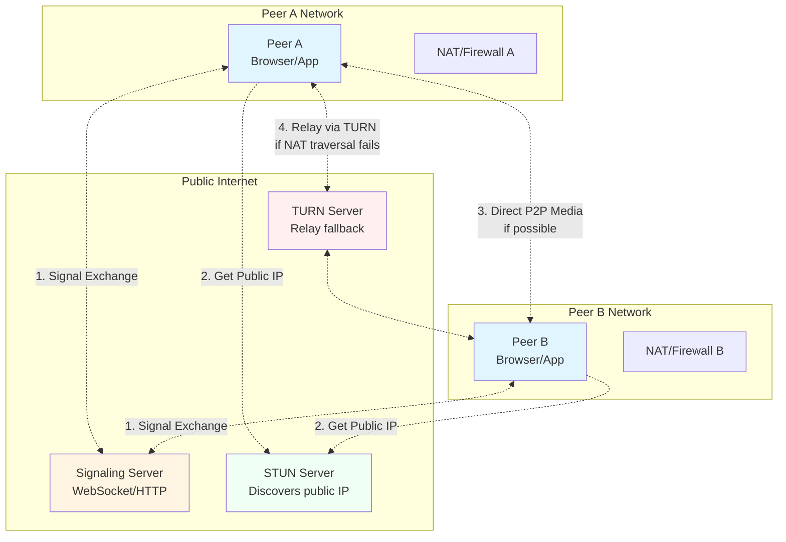
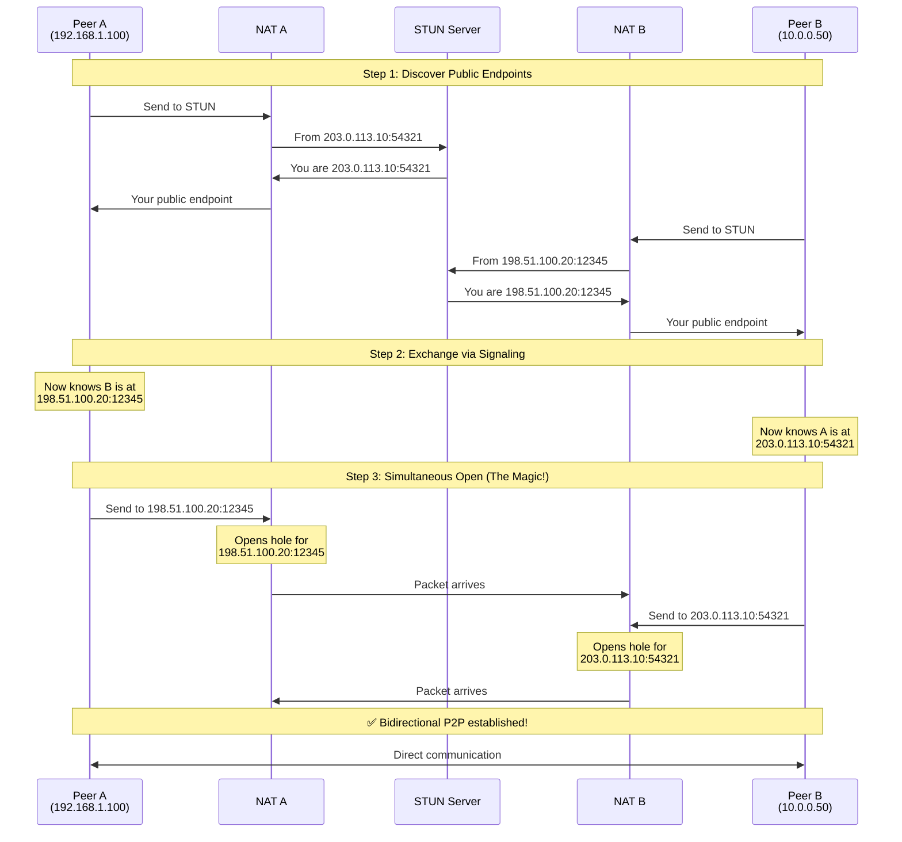
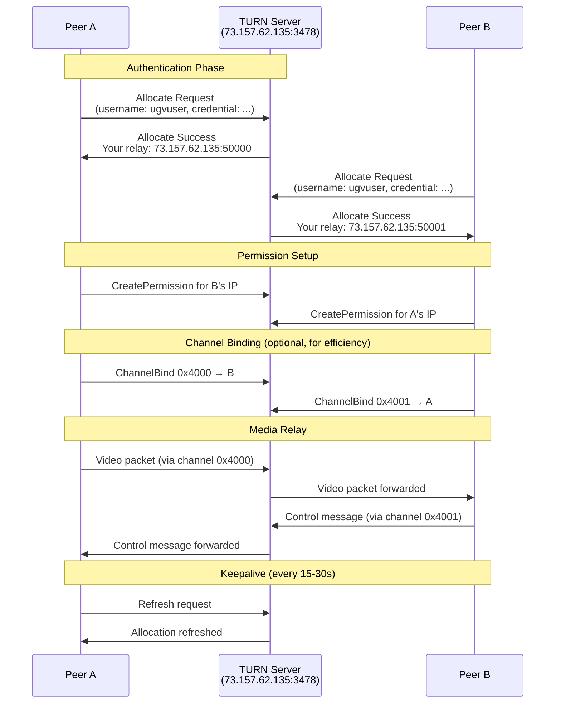

### 2. **Firewall Rules Must Permit**
```
┌─────────────────────────────────────────┐
│ ✅ REQUIRED FIREWALL CONDITIONS:        │
├─────────────────────────────────────────┤
│                                         │
│ 1. Allow OUTBOUND UDP traffic           │
│    • Port range: 1024-65535 (ephemeral)│
│    • Destination: Any                   │
│                                         │
│ 2. Allow INBOUND UDP on same ports      │
│    • From: Specific IP learned via STUN│
│    • NAT must maintain port mapping     │
│                                         │
│ 3. UDP timeout >= 30 seconds            │
│    • Connection must stay "open"        │
│    • Keepalives prevent timeout         │
│                                         │
└─────────────────────────────────────────┘
```

### 3. **Timing Synchronization**

The "simultaneous open" must happen within NAT timeout window:
```
Time →
    0s        1s        2s        3s        4s        5s
    │         │         │         │         │         │
A:  ●─────────●─────────●─────────●─────────●─────────●
    Send      Send      Send      (hole open for 30s)
    
B:            ●─────────●─────────●─────────●─────────●
              Send      Send      (hole open for 30s)
    
        ┌─────┴─────┐
        │   Both    │
        │ NATs have │   ✅ Success!
        │holes open │
        └───────────┘
```

If timing is off:
```
Time →
    0s        10s       20s       30s
    │         │         │         │
A:  ●─────────────────────────────X (NAT closes hole)
    Send
    
B:                                ●
                                  Send (too late!)
                                  
                                  ❌ Blocked by NAT_A
```

## Why Symmetric NAT Breaks P2P

Here's the problem with Symmetric NAT:
```
┌──────────────────────────────────────────────┐
│ Symmetric NAT Behavior                       │
├──────────────────────────────────────────────┤
│                                              │
│ Internal IP: 192.168.1.100:5000             │
│                                              │
│ When talking to STUN (1.2.3.4:3478):        │
│   → Public mapping: 203.0.113.10:54321      │
│                                              │
│ When talking to Peer B (5.6.7.8:9999):      │
│   → Public mapping: 203.0.113.10:54322      │
│      (DIFFERENT PORT!)                       │
│                                              │
│ Peer B learns 54321 from STUN exchange,     │
│ but A will use 54322 when contacting B!     │
│                                              │
│ ❌ Mismatch = Connection fails               │
└──────────────────────────────────────────────┘
```

Visualization:
```
        ┌─────────────────┐
        │  Symmetric NAT  │
        │   (Peer A)      │
        └─────────────────┘
              ││  ││
    To STUN   ││  ││  To Peer B
    :54321    ││  ││  :54322
              ││  ││
              ││  ││
          Different ports!
          Peer B will send
          to :54321, but
          NAT expects :54322
              ❌ BLOCKED
```

## Real-World Conditions Summary

For **direct P2P to work**, you need:

### ✅ Must Have:
1. **At least ONE peer NOT behind Symmetric NAT**
2. **Both NATs allow UDP hole punching** (most do)
3. **Firewalls allow established UDP sessions**
4. **STUN server accessible** from both peers
5. **Coordinated "simultaneous open"** via signaling

### 🚫 Deal Breakers:
1. **Both peers behind Symmetric NAT** → 95% failure rate
2. **Corporate firewall blocks all UDP** → 100% failure
3. **Carrier-grade NAT (CGNAT)** → Often needs TURN
4. **Mobile networks with strict firewalls** → Often needs TURN

### 📊 Statistics from the Field:
- **~80-85%** of connections work with just STUN
- **~10-15%** require TURN relay
- **~5%** fail completely (strict enterprise networks)

## Practical Example: Your Robot Setup

If your Raspberry Pi is at home and remote viewer is also at home:
```
Home Network A              Home Network B
┌─────────────┐            ┌─────────────┐
│ Router/NAT  │            │ Router/NAT  │
│  (typical   │◀═══════════▶│  (typical   │
│  home ISP)  │   Direct   │  home ISP)  │
│             │    P2P     │             │
│  ┌──────┐   │   Works!   │  ┌───────┐  │
│  │ Pi/  │   │    ✅      │  │Browser│  │
│  │Robot │   │            │  │       │  │
│  └──────┘   │            │  └───────┘  │
└─────────────┘            └─────────────┘
```


## When to Use TURN
```
┌─────────────────────────────────────────┐
│ ALWAYS configure TURN servers, because: │
├─────────────────────────────────────────┤
│                                         │
│ ✅ Provides guaranteed connectivity     │
│ ✅ Handles worst-case NAT scenarios     │
│ ✅ Required for ~10-15% of connections  │
│ ✅ Automatic fallback (transparent)     │
│                                         │
│ But expect:                             │
│ ⚠️  2x bandwidth usage                  │
│ ⚠️  Higher latency                      │
│ ⚠️  Server infrastructure costs         │
│                                         │
└─────────────────────────────────────────┘
