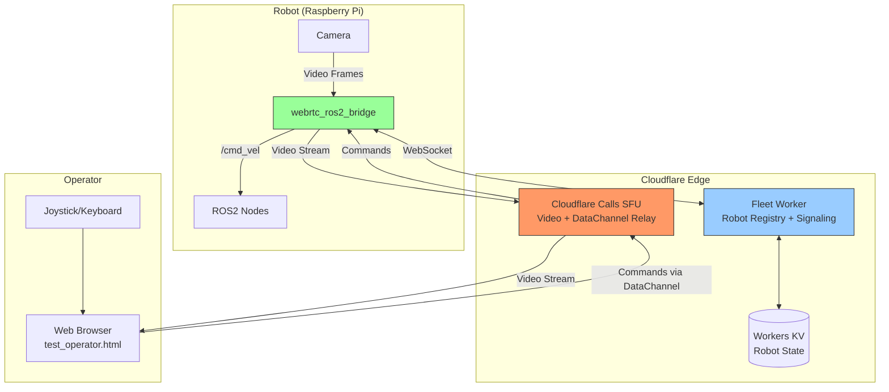
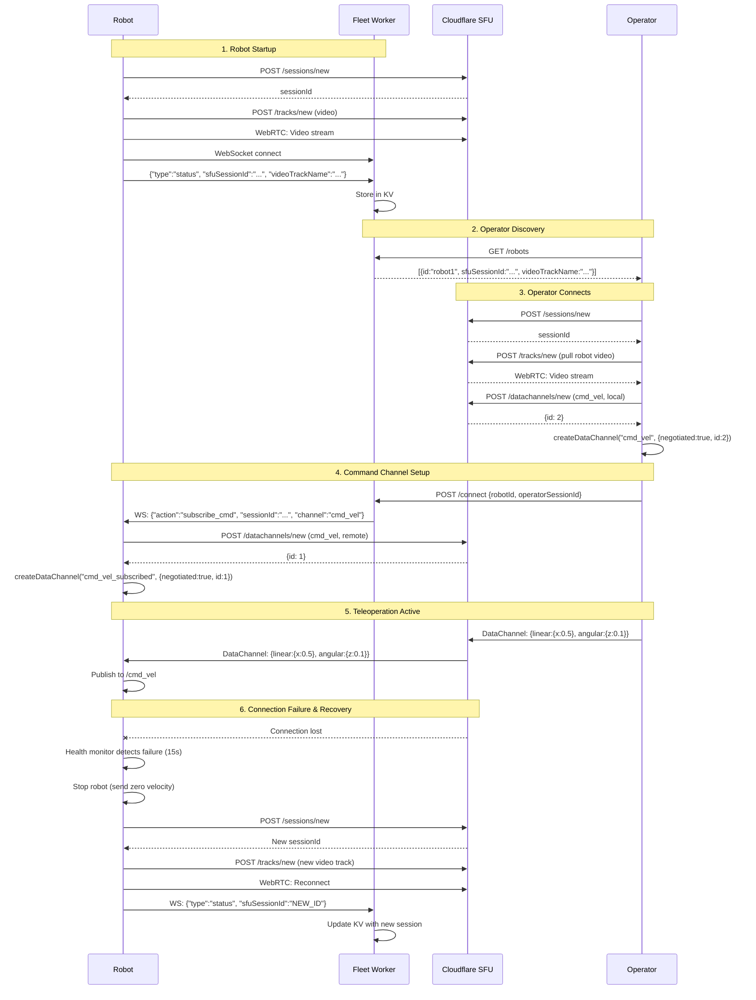

# WebRTC ROS2 Bridge

A ROS2 package that enables low-latency remote teleoperation of robots via WebRTC, using **Cloudflare Calls SFU** for media relay and **Cloudflare Workers** for fleet management.

## Architecture Overview



## Key Features

- **Cloud-based SFU**: No NAT traversal issues - all media goes through Cloudflare's global edge network
- **Fleet Management**: Multiple robots can register and be discovered by operators
- **Low Latency**: Cloudflare's edge network provides sub-100ms latency globally
- **Scalable**: SFU architecture supports multiple operators viewing the same robot
- **Secure**: All connections use DTLS/SRTP encryption
- **Self-Healing**: Automatic session recovery with proactive health monitoring and exponential backoff
- **ROSBridge Integration**: Optional WebSocket proxy for full ROS topic/service access from browser

## Components

### Robot Side

| File | Description |
|------|-------------|
| `bridge_node.py` | Main ROS2 node that orchestrates all components |
| `sfu_manager.py` | Manages WebRTC connection to Cloudflare Calls SFU with automatic session recovery |
| `signaling_client.py` | WebSocket client for Fleet Worker communication with connection validation |
| `rosbridge_proxy.py` | Integrated signaling client with ROSBridge WebSocket proxying |
| `cloudflare_calls.py` | HTTP client for Cloudflare Calls REST API |
| `video_source.py` | Captures video from camera and creates WebRTC track |
| `command_handler.py` | Receives commands and publishes to `/cmd_vel` |

### Cloud Side (in `cloud/workers/fleet-worker/`)

| Component | Description |
|-----------|-------------|
| Fleet Worker | Cloudflare Worker with Durable Objects for WebSocket handling |
| Workers KV | Stores robot registry (online status, SFU session IDs) |

## Connection Flow



## Configuration

Configuration is loaded from `config/bridge_config.yaml`:

```yaml
robot:
  id: "robot1"
  cmd_vel_topic: "/cmd_vel"
  max_linear_speed: 1.0
  max_angular_speed: 2.0

video:
  device: "/dev/video0"
  width: 640
  height: 480
  fps: 30

cloudflare:
  app_id: "your-cloudflare-app-id"
  app_token: "your-cloudflare-app-token"  # Or use env var

fleet:
  worker_url: "wss://fleet-worker.your-domain.workers.dev/ws/robot"
  enable_rosbridge_proxy: true  # Optional: enable ROSBridge WebSocket proxying
  rosbridge_url: "ws://localhost:9090"  # Local rosbridge_server URL
```

### Environment Variables

Environment variables override config file values:

| Variable | Description |
|----------|-------------|
| `CLOUDFLARE_APP_ID` | Cloudflare Calls Application ID |
| `CLOUDFLARE_APP_TOKEN` | Cloudflare Calls API Token |
| `FLEET_WORKER_URL` | Fleet Worker WebSocket URL |
| `ROBOT_ID` | Unique robot identifier |

## Usage

### Starting the Robot Bridge

```bash
# Source ROS2 workspace
source install/setup.bash

# Set credentials (or use config file)
export CLOUDFLARE_APP_ID="your-app-id"
export CLOUDFLARE_APP_TOKEN="your-token"

# Launch the bridge
ros2 launch webrtc_ros2_bridge bridge.launch.py
```

### Operator Test Console

Open `test_operator.html` in a web browser:

1. Enter your Cloudflare App Token
2. Click "Refresh Robots" to see online robots
3. Select a robot and click "Create SFU Session"
4. Click "Connect to Robot"
5. Use the joystick or WASD keys to control the robot

## DataChannel Protocol

Commands are sent as JSON over the `cmd_vel` DataChannel:

```json
{
  "linear": {"x": 0.5, "y": 0.0, "z": 0.0},
  "angular": {"x": 0.0, "y": 0.0, "z": 0.1}
}
```

The robot converts this to a `geometry_msgs/Twist` message and publishes to `/cmd_vel`.

### Command Rate Limiting

The operator frontend implements command rate limiting to prevent overwhelming the DataChannel:

- **Maximum rate**: 10 commands per second (100ms minimum interval)
- **Backpressure handling**: Commands are dropped if the DataChannel buffer exceeds 64KB
- **Dropped message tracking**: Warnings are logged when messages are dropped due to buffer overflow

This throttling reduces SCTP transport load and improves connection stability during teleoperation, especially when both video streaming (uplink) and command transmission (downlink) are active simultaneously.

## Why Cloudflare SFU?

Traditional P2P WebRTC requires NAT traversal which fails in many scenarios:

| Scenario | P2P Success | SFU Success |
|----------|-------------|-------------|
| Both on home networks | ~85% | 100% |
| One behind corporate firewall | ~50% | 100% |
| Both behind symmetric NAT | ~5% | 100% |
| Mobile networks (CGNAT) | ~60% | 100% |

The SFU approach guarantees connectivity at the cost of routing all media through Cloudflare's edge network (which adds minimal latency due to their global presence).

## Dependencies

### Python
- `aiortc` - WebRTC implementation for Python
- `aiohttp` - Async HTTP client
- `websockets` - WebSocket client
- `opencv-python` - Video capture
- `av` - Video encoding

### ROS2
- `rclpy`
- `geometry_msgs`
- `std_msgs`

## Session Recovery and Reliability

The bridge includes comprehensive session recovery mechanisms to handle network issues and maintain reliable connections:

### Automatic Session Recovery

When the WebRTC connection fails, the system automatically:

1. **Detects failures** via connection state monitoring
2. **Stops the robot** immediately to prevent runaway behavior
3. **Creates a new SFU session** with Cloudflare
4. **Re-establishes the WebRTC connection**
5. **Updates the Fleet Worker** with the new session ID

### Proactive Health Monitoring

A background health monitor checks every 10 seconds:
- Peer connection state
- ICE connection state
- Duration of degraded states

If the connection is degraded for more than 15 seconds (before Cloudflare's 30-second timeout), recovery is triggered proactively.

### Exponential Backoff

To handle persistent network issues gracefully:
- 1st recovery attempt: 2 seconds delay
- 2nd attempt: 4 seconds delay
- 3rd attempt: 8 seconds delay
- Max delay: 30 seconds
- Counter resets after 5 minutes of stable connection

### Session Validation

After recovery, the system:
- Waits 5 seconds for connection to stabilize
- Validates the peer connection reached 'connected' state
- Logs warnings if connection is unstable
- Will re-trigger recovery if needed

### What This Means for You

- **Transient network issues**: Robot automatically recovers within 15-20 seconds
- **Extended outages**: System keeps retrying with increasing delays until network is restored
- **Operator reconnection**: Always connect to a fresh, valid session (no stale session IDs)
- **Safety**: Robot always stops on connection loss to prevent runaway

## Troubleshooting

### Video not showing
- Check camera permissions: `ls -la /dev/video0`
- Verify camera works: `ffplay /dev/video0`
- Check SFU connection logs for errors
- Look for "Session recovery" messages indicating connection issues

### Commands not received
- Verify DataChannel shows "open" state on both sides
- Check that negotiated IDs match (logged on both sides)
- Ensure Fleet Worker signaling completed
- Check for connection state warnings in logs

### Robot not appearing in list
- Check WebSocket connection to Fleet Worker
- Verify KV entry exists (use Wrangler dashboard)
- Check robot is sending status with `sfuSessionId`
- Ensure connection state is healthy (not 'disconnected' or 'failed')

### Frequent session recovery
- Check network stability between robot and internet
- Look for patterns in recovery timing (every 30s suggests Cloudflare timeout)
- Verify STUN server is reachable: `stun.cloudflare.com:3478`
- Check for NAT/firewall issues blocking UDP traffic

### Recovery not working
- Check logs for "Session recovery failed" messages
- Verify Cloudflare credentials are still valid
- Ensure `/api/calls/sessions/new` endpoint is accessible
- Check for API rate limiting errors

## References

- [Cloudflare Calls Documentation](https://developers.cloudflare.com/calls/)
- [Cloudflare Calls API Spec](https://developers.cloudflare.com/calls/static/calls-api-2024-05-21.yaml)
- [DataChannel Example](https://github.com/cloudflare/realtime-examples/blob/main/echo-datachannels/index.html)
- [Fleet Management Implementation Plan](../../../FLEET_MANAGEMENT_IMPLEMENTATION_PLAN.md)
